# cagent — Implementation Plan

> v2.1 completed. Historical details archived in [ARCHIVE.md](ARCHIVE.md).

## Current State (v2.1 — 2026-05-17)

**Working**: 13 modules, 155 pytest tests PASS, 2.86x speedup benchmark.
Core flow: `cagent plan <goal>` → `cagent run tasks.md` → integration branch.

### Architecture

```mermaid
flowchart LR
    PLAN["cagent plan <goal>"] --> TASKS[tasks.md + conventions.md]
    TASKS --> CLI["cagent run tasks.md -j 4"]
    CLI --> DISP[Dispatcher<br/>asyncio + dependency graph]
    DISP -->|worktree| W1[Worker 1<br/>claude -p]
    DISP -->|worktree| W2[Worker 2<br/>claude -p]
    DISP -->|worktree| WN[Worker N<br/>claude -p]
    W1 --> INT[Integrator<br/>cherry-pick + conflict resolver]
    W2 --> INT
    WN --> INT
    INT --> OUT[integration branch]
```



### Design Constraints (unchanging)
- Python ≥ 3.11, **零第三方依赖**
- 模型零配置 — 继承 Claude Code 主会话 env
- 不可逆命令 sandbox 拦截，push 需要 y/N 确认
- 跨平台 Windows + Unix
- 即下即用：clone → `python -m cagent run tasks.txt`

---

## v3.0 — Next Milestones

### 3.1 Bug 修复 (P0 — 代码审查 2026-05-18 发现)

#### 3.1.1 `cli.py:216` `_get_repo_root()` 无错误处理
- `subprocess.run(..., check=True)` 在非 git 仓库内运行时抛 `CalledProcessError` 暴露 traceback
- 其他所有用户输入路径（`--base`/tasks/push）都有友好错误，唯独此处遗漏
- **修复**：try/except 包裹，输出 `"Error: not inside a git repository."`

#### 3.1.2 `integrator.py:359-388` async `_run_git()` 无 timeout
- 同步 `worktree.py:_git()` 已在 Phase 24 添加 `timeout=60`
- 但 integrator 的 async `_run_git()` 没有任何超时保护
- 如果 git cherry-pick/add 挂起（SSH 等待/大文件/网络），进程永久阻塞
- 注意：父级的 `asyncio.timeout(timeout)` 只包裹 `claude -p` 子进程，不覆盖 `_run_git` 调用
- **修复**：`asyncio.wait_for(proc.communicate(), timeout=60)` + `TimeoutError` → kill proc

#### 3.1.3 `log.py:25-33` LinePrinter 取消时丢弃队列事件
- `CancelledError` 直接 break，queue 中剩余事件（可能包含 DONE/FAIL）未 flush
- 导致 `cagent run` 最后几条事件在 stdout 中消失
- **修复**：break 前 `while not self._queue.empty(): self._print_line(*self._queue.get_nowait())`

#### 3.1.4 `memory.py:62-64` 缓存失效不考虑内容变化
- `build_shared_context` 缓存 key 仅为 `tuple(sorted(task_ids))`
- 如果 task A 完成后写入 memory，然��� task B 完成前再次调用（相同 ids），返回正确
- 但如果 task A 的 memory 被 `append()` 更新（integrator 场景），缓存不会失效
- **修复**：缓存 key 加入 `memory_dir.stat().st_mtime`（目录修改时间）或取消缓存

### 3.2 可靠性加固 (P1)

#### 3.2.1 自动重试机制
- `--retries N` flag（默认 0），task 失败后在同一 worktree 重试
- 重试前检查失败原因：网络超时/rate limit → 退避重试；代码错误 → 不重试
- 重试次数记录到 TaskProgress + summary.md

#### 3.2.2 Token 使用量追踪
- `EventParser` 解析 `result` 事件中的 `usage` 字段（input_tokens, output_tokens）
- `TaskProgress` 新增 `tokens_in` / `tokens_out` 字段
- `cagent status` 和 summary.md 展示 token 消耗
- 可选：估算费用（需要模型→价格映射表）

#### 3.2.3 单 Task 取消
- `cagent cancel <task-id>` 子命令
- 通过 PID 文件定位 worker 进程 → SIGTERM → 标记 failed
- `watch` 模式下可考虑交互式取消（v3.1+）

### 3.3 测试补全 (P2)

#### 3.3.1 agent.py mock 测试
- Mock `asyncio.create_subprocess_exec`
- 测试场景：正常完成、超时、非零退出、stdin pipe 错误、commit 失败
- 测试 conventions/shared_context 注入

#### 3.3.2 integrator.py mock 测试
- Mock git cherry-pick 成功/冲突/失败
- 测试 integrator agent 调用流程
- 测试 squash 模式
- 测试 partial integration（部分失败）

#### 3.3.3 端到端验收补测
- `cagent watch` TTY 下 1s 刷新 + `q` 退出
- `cagent watch` 非 TTY 退化为单次 status
- `cagent push` 输入 `n`/回车/Ctrl-C → 无 push
- `--worker-model` flag 实际传递验证
- `--timeout 1` → 标 failed，integrator 合入成功部分

### 3.4 功能增强 (P3)

#### 3.4.1 Integrator 多轮验证
- cherry-pick 后自动运行 lint / test（如果项目有配置）
- 失败则给 integrator agent 第二轮 prompt 修复
- `--post-integrate-cmd "pytest"` flag

#### 3.4.2 Integrator 多策略
- 除 cherry-pick 外支持 `--strategy merge|rebase`
- merge：`git merge --no-ff <branch>`，保留分支拓扑
- rebase：`git rebase --onto integration base branch`

#### 3.4.3 Watch WebSocket 推送
- 本地起 HTTP server（stdlib `http.server` + WebSocket via `asyncio`）
- 推送 dashboard.json 变化
- 简单 HTML 前端展示（可选）

#### 3.4.4 可选 pip install 支持
- `pyproject.toml` 已有 `[project]` 段
- 添加 `[project.scripts]` entry point：`cagent = "cagent.cli:main"`
- 保持零依赖 clone-and-run 仍然可用

### 3.5 安全演进 (P4 — 长期)

#### 3.5.1 Docker 沙箱模式
- `--sandbox docker` flag
- Worker 在 Docker 容器内运行，volume mount worktree
- 网络隔离（无法 push）
- 文件系统隔离（只能访问 worktree 目录）

#### 3.5.2 Resource Limit
- `--max-tokens-per-task N`：单 task token 上限
- `--max-cost-per-run $N`：单次 run 花费上限
- 达到阈值时 graceful stop

---

## Known Limitations (v2.1, accepted)

1. **Sandbox bypass via indirect execution**: `bash x.sh` / `python -c subprocess.run(...)` 可绕过 hook 正则。claude -p 在 acceptEdits 模式下不会主动绕过，worktree 无 push 凭据。
2. **API Key in env**: `--api-key` 写入 `os.environ`，crash dump 中可见。CLI 标准做法。
3. **Prompt injection**: 用户 goal 直接拼接进 architect prompt。用户即作者，无第三方注入场景。
4. **No Windows TTY watch test**: `cagent watch` 的 ANSI 刷新未在 Windows cmd.exe 下完整验证。

---

## Module Map (for reference)

```
cagent/
├── __init__.py        # empty
├── __main__.py        # entry + version check
├── cli.py             # argparse + 8 subcommands (~500 LOC)
├── tasks.py           # Task dataclass + txt/md parsing
├── worktree.py        # git worktree CRUD + timeout
├── safety.py          # sandbox deny patterns + hook script
├── agent.py           # claude -p subprocess + commit
├── progress.py        # EventParser + Dashboard + TaskProgress
├── dispatcher.py      # async scheduler + dependency graph
├── integrator.py      # cherry-pick + conflict resolution
├── compat.py          # cross-platform stdin/ANSI/atomic_write
├── log.py             # LinePrinter for console output
└── memory.py          # per-run shared context between agents
```
