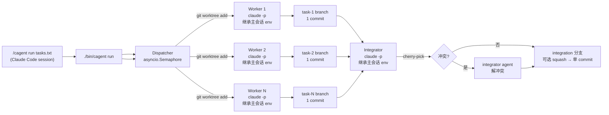

# Concurrent Agent Workflow — v1 Bootstrap

## Context

仓库目前只有 `README.md` 和一句方向声明（`/home/user/repo/README.md`）。需要从零搭一个个人代码工作流：一条 CLI 命令把若干任务并发分发给多个 `claude -p` 实例，每个实例在独立的 git worktree 里干活，最后由控制器把各分支汇总成一个统一的集成分支并产生最终 commit。

设计偏好（已与用户确认）：
- 控制器用 **Python**，**只依赖标准库**，不引入 rich/click/toml/aider/agent-sdk 等任何第三方包。
- **Python ≥ 3.11**（用 `asyncio.TaskGroup`）。入口脚本启动时检查版本，低于 3.11 立即报错退出并给出明确提示，而非让用户看到 `ImportError`。
- v1 用**扁平任务队列**，结构为后续演进到「架构师 → 多 builder → integrator」分层留好接口。
- 汇总冲突时**调用 integrator agent**来解冲突，而非人工或自动三方合并。
- **跨平台（Windows + Unix）**：开发环境为 Windows，设计必须兼容两端。详见各模块中的平台适配说明。
- **入口在 Claude Code 内**：注册成 slash command `/cagent`，用户在 Claude Code 会话里输入 `/cagent run tasks.txt` 触发；主 agent 通过 Bash/PowerShell 调用 `python -m cagent` 把进度回流到会话。同时保留 `bin/cagent`（Unix）和 `bin/cagent.cmd`（Windows）作为便捷 CLI 入口供脚本调用。
- **模型零配置 — 跟随 Claude Code**：worker / integrator 永远启动 `claude -p`，**不传 `--model`，不传 endpoint，不传 key**。子进程继承父进程环境变量（`ANTHROPIC_BASE_URL` / `ANTHROPIC_API_KEY` / `ANTHROPIC_MODEL` / `ANTHROPIC_AUTH_TOKEN` / `CLAUDE_CODE_*` 等），所以 Claude Code 主会话当下跑什么模型 / 接哪个 proxy（LiteLLM 把 mimo/qwen/gpt 伪装成 Anthropic API、Bedrock、Vertex），cagent 就自动跑同一个。**用户不需要在 cagent 里配置任何模型相关的东西**。
- **可选 override**：极端情况下想让 worker 用更便宜模型而主会话用 opus，提供 `--worker-model <id>` / `--integrator-model <id>` 可选 flag；不传则保持继承。这是逃生舱，不是默认路径。
- **人在回路只有一道门**：`cagent run` 全流程（worktree → worker → integrator）**绝不**调用 `git push` 或访问任何远程。要发布只能显式 `cagent push <branch>`，必须 y/N 确认。
- **不可逆命令拦截**：worker / integrator 在 worktree 里跑时，cagent 在 worktree 内注入 `.claude/settings.local.json` 的 `PreToolUse` Bash deny hook，把 `git push`、`git reset --hard`、`git clean -fd`、`rm -rf`（Unix）/ `Remove-Item -Recurse -Force`（Windows）等直接拒绝。其他命令 agent 自决，不打扰用户。
- **即下即用**：clone 仓库 → 在 Claude Code 会话里 `/cagent run tasks/example.txt` 或终端 `python -m cagent run tasks/example.txt` 就能跑；不要求 `pip install`，不要求配置文件存在，**不要求声明任何模型**。

环境：`claude` 2.1.131 已在 PATH 中可直接用（Windows: `claude.cmd` / Unix: `claude`）。cagent 不依赖 aider 或任何其他 agent CLI——只调用 `claude` 一种工具，模型层完全交给 Claude Code 的现有配置。

## Shape



关键约束：worktree 之间彼此隔离；集成串行（cherry-pick 顺序 = 任务在 queue 中的顺序），保证可复现；**所有 agent 子进程都继承主 Claude Code 会话的环境变量**，从而自动跟随主会话的模型/endpoint。

## Repo Layout（新建）

```
project/
├── README.md                  # 已存在，更新一段使用说明
├── bin/
│   ├── cagent                 # Unix shebang 脚本
│   └── cagent.cmd             # Windows 批处理入口
├── .gitignore                 # 新建，排除 .cagent/
├── .claude/
│   └── commands/
│       └── cagent.md          # slash command 定义，/cagent 入口
├── cagent/
│   ├── __init__.py
│   ├── __main__.py            # 支持 python -m cagent（含版本检查）
│   ├── cli.py                 # argparse 入口
│   ├── tasks.py               # Task 数据类 + tasks 文件解析
│   ├── worktree.py            # git worktree 创建 + sandbox 注入 + 清理
│   ├── safety.py              # 注入 .claude/settings.local.json 的 PreToolUse hook
│   ├── agent.py               # spawn `claude -p` 子进程，统一日志 + 提交
│   ├── progress.py            # stream-json 事件解析、TaskProgress、Dashboard 落盘
│   ├── dispatcher.py          # asyncio 工作池
│   ├── integrator.py          # cherry-pick + 冲突时调用 integrator agent
│   ├── compat.py              # 跨平台兼容层（stdin 轮询、路径处理等）
│   └── log.py                 # 控制台进度打印（订阅 progress 事件）
└── tasks/
    └── example.txt            # 一份示例任务清单
```

**完全没有 `pyproject.toml`、`cagent.toml`、`models.py`**。

**Unix 入口** `bin/cagent`（两行 shim）：
```python
#!/usr/bin/env python3
from cagent.cli import main; main()
```

**Windows 入口** `bin/cagent.cmd`：
```batch
@echo off
python -m cagent %*
```

**推荐跨平台入口**：`python -m cagent ...`（任何平台始终可用）。

clone 后三种入口任选：
- 在 Claude Code 会话里：`/cagent run tasks/example.txt`。
- Unix 终端：`./bin/cagent run tasks/example.txt`。
- Windows 终端：`bin\cagent.cmd run tasks/example.txt` 或 `python -m cagent run tasks/example.txt`。

三种都不需要任何模型配置——cagent 直接复用 Claude Code 当前的模型与凭据。

运行时状态（git-ignored）：
```
.cagent/
├── runs/<UTC-timestamp>/
│   ├── tasks.json             # 解析后的任务 + 实时状态
│   ├── dashboard.json         # 全 run 滚动状态（cagent watch 读这个）
│   ├── progress/
│   │   └── task-<id>.json     # 每任务最新一条状态快照（last tool / elapsed / count）
│   ├── events/
│   │   └── task-<id>.jsonl    # 每任务全量事件流（append-only）
│   ├── logs/task-<id>.log     # 每任务 claude -p 原始 stdout（含 stream-json）
│   └── summary.md             # 终态汇总
└── worktrees/<run>/task-<id>/ # 临时 worktree，run 结束后默认清理
```

## Implementation Plan

按下面顺序逐文件实现，每步独立可测。

### 1. `bin/cagent` + `bin/cagent.cmd` + `cagent/__main__.py` + `.gitignore`
- `bin/cagent`（Unix）：`#!/usr/bin/env python3` 两行 shim，做 `sys.path` 调整后 `from cagent.cli import main; main()`。`chmod +x`。
- `bin/cagent.cmd`（Windows）：`@echo off` + `python -m cagent %*`。
- `cagent/__main__.py`：入口处做 **Python 版本检查**，低于 3.11 时 `sys.exit("cagent requires Python >= 3.11 (found {sys.version}). Please upgrade.")`，避免用户看到 `ImportError: cannot import name 'TaskGroup'`。
- `.gitignore`：`.cagent/`、`__pycache__/`。
- 启动方式（任选其一）：`./bin/cagent ...`（Unix）、`bin\cagent.cmd ...`（Windows）、`python -m cagent ...`（跨平台推荐）。

### 2. `cagent/tasks.py`
- `@dataclass Task(id: str, prompt: str, branch: str, status: Literal["pending","running","done","failed","noop"], commit_sha: str|None, log_path: Path)`。
- `parse_tasks_file(path) -> list[Task]`：每非空、非 `#` 行 = 一个任务；`id` = `f"{idx:03d}"`；`branch` = `cagent/{run_id}/task-{id}`。
- `dump_state(run_dir, tasks)` / `load_state`：JSON 序列化，便于崩溃恢复 + 调试。

### 3. `cagent/worktree.py`
- `create_worktree(repo_root, worktree_path, branch, base_sha)`：`git worktree add -b <branch> <path> <base_sha>`。
- `remove_worktree(repo_root, worktree_path)`：`git worktree remove --force`，再 `git branch -D` 留给 caller 决定。
- `current_head(repo_root) -> str`：捕获 base_sha。
- 所有 git 调用走 `subprocess.run(check=True, capture_output=True)`，错误时把 stderr 透传。

### 4a. `cagent/safety.py`（不可逆命令拦截）

- `prepare_sandbox(worktree_path)`：在 worktree 里写 `.claude/settings.local.json`，注册 `PreToolUse` Bash hook，匹配以下正则即 `deny`：
  - Unix 危险命令：`^\s*git\s+push\b` / `^\s*git\s+reset\s+--hard\b` / `^\s*git\s+clean\s+-[a-z]*f` / `^\s*rm\s+-[a-z]*[rf][a-z]*[rf]`（匹配 `-rf` / `-fr` / `-Rf` / `-fR`）/ `^\s*git\s+update-ref\b` / `^\s*git\s+remote\s+(set-url|add)\b`。
  - Windows 危险命令（PowerShell）：`Remove-Item\s.*-Recurse.*-Force` / `Remove-Item\s.*-Force.*-Recurse` / `del\s+/[sS]` / `rd\s+/[sS]`。
  - 注意：Claude Code 在 Windows 上也可能通过 Bash tool 调用 Unix 风格命令（Git Bash / WSL），所以两套正则都要注册。
- hook 直接拒绝（exit 非零），agent 看到拒绝信息后自决换路或放弃。
- 拦截是**拒绝**而非"暂停等用户"——worker 是 headless 异步跑的，无法人工同步。设计意图：危险命令永远不该在 cagent 流程里发生，它们要么不必要、要么应由用户在最终阶段（push）人工进行。

### 4b. `cagent/agent.py`
- `async run_agent(task, worktree_path, run_dir, timeout, model_override: str | None = None) -> AgentResult`：
  1. `safety.prepare_sandbox(worktree_path)`。
  2. 组装命令：`cmd = ["claude", "-p", task.prompt, "--permission-mode", "acceptEdits", "--output-format", "stream-json", "--verbose"]`；如果 `model_override` 不为 None，追加 `--model <id>`。**否则不传 `--model`**——claude CLI 自动走父进程 `ANTHROPIC_MODEL`/默认配置。
  3. **Prompt 传递策略**：prompt 长度 > 8000 字符 或 包含 `"` / `\` / 换行符时，走 stdin pipe（`proc.stdin.write(prompt.encode()); proc.stdin.close()`），命令中用 `"-p", "-"` 占位；否则直接作为 `-p` 参数传递。这样避免 shell 转义问题和参数长度限制。
  4. `asyncio.create_subprocess_exec(*cmd, cwd=worktree_path, env=os.environ.copy(), stdout=PIPE, stderr=STDOUT)`。**关键**：env 直接 copy，不裁剪、不注入。
  5. **stdout 一行一行读**：每行做三件事：
     - 原样追加到 `runs/<ts>/logs/task-<id>.log`（debug 用）。
     - 喂给 `progress.EventParser.feed(line) -> Event | None`，解析成 normalized event。
     - 若是有效事件：append 到 `runs/<ts>/events/task-<id>.jsonl`，更新内存里的 `TaskProgress`，原子写 `runs/<ts>/progress/task-<id>.json`，并通过 asyncio queue 推到 dispatcher 的 dashboard 聚合器。
  6. 超时 → `proc.kill()` → 状态置 failed。
  7. 进程退出后**统一**做提交：`git status --porcelain` 有变更 → `git add -A && git commit -m "task {id}: {prompt-first-line}"`；无变更 → 标 `noop`。
- Worker 与 Integrator 共用这个函数（integrator 复用，task id 用 `_integrator`），差别只在 `model_override`。

### 4c. `cagent/progress.py`（**观测层**）

数据：
```python
@dataclass
class Event:
    ts: float                  # epoch seconds
    kind: Literal[             # 来自 stream-json 的事件类型映射
        "start","tool_use","tool_result","text","thinking",
        "denied","done","error"]
    summary: str               # 一行人话："Edit src/foo.py"、"Bash: pytest -k user"、"text: 修复了..."
    raw: dict                  # 原始 JSON event，留作 events.jsonl

@dataclass
class TaskProgress:
    task_id: str
    status: Literal["pending","running","done","failed","noop"]  # "denied" 不是任务状态——工具被拒不代表任务失败
    started_at: float | None
    ended_at: float | None
    last_event: Event | None
    last_activity: str         # 例如 "Edit src/foo.py"
    tool_count: int            # 累积 tool_use 数量
    bytes_seen: int            # 累积输出字节，可作粗粒度进度
    commit_sha: str | None
    fail_reason: str | None
```

- `EventParser`：
  - 流式吞 `claude -p --output-format stream-json --verbose` 的 JSONL。
  - 关心的事件子集：
    - `system.init`（含模型信息）→ `kind="start"`，summary 形如 `"start (model=claude-opus-4-7)"`。
    - `assistant.content_block_start.tool_use` → `kind="tool_use"`，summary 提炼工具名 + 参数关键字段（Edit → file_path、Bash → command 头部、Read → file_path）。
    - `user.tool_result` → `kind="tool_result"`，summary 截短结果首行；deny 类拦截标 `kind="denied"`。
    - `assistant.content_block_start.text` → `kind="text"`，summary = 文本前 80 字。
    - `assistant.content_block_start.thinking` → `kind="thinking"`（默认折叠在 events.jsonl，不进 dashboard summary）。
    - `result` → `kind="done"`，summary = `"done"`；含 token 使用统计。
  - 解析失败时 fallback：`Event(kind="text", summary=line[:80], raw={"raw":line})`，绝不丢事件。

- `Dashboard`（dispatcher 持有一个）：
  - 维护 `dict[task_id, TaskProgress]`。
  - 每次有任务事件来：更新条目，原子写 `runs/<ts>/dashboard.json`（写 tmp + rename）。
  - 同时把一条人类可读的行推到 dispatcher 的 stdout printer（见 §6）。

- 原子写：`tmp = path.with_suffix(".tmp")`、`tmp.write_text(...)`、`tmp.replace(path)` —— 单文件、单写者，无锁。`watch` 命令是只读读者，碰到刚好被替换的瞬间最坏读到旧版本，下一秒刷新即正确。

### 5. `cagent/dispatcher.py`
- `async run(tasks: list[Task], concurrency: int, run_dir: Path, base_sha: str)`：
  - `sem = asyncio.Semaphore(concurrency)`。
  - 每个任务一个协程：拿信号量 → 建 worktree → 调 `agent.run_agent` → 释放。
  - 用 `asyncio.TaskGroup` 等待全部完成（一个失败不阻断别的，但记录）。
  - 每次状态变化调 `tasks.dump_state` 更新 `tasks.json`。
- 不在这里清理 worktree —— 留到 integrator 完成之后，便于排查失败任务。

### 6. `cagent/integrator.py`
- `integrate(tasks, run_dir, base_sha, repo_root, squash: bool) -> str`：
  - 创建 integration worktree：`.cagent/worktrees/<run>/_integration`，分支 `cagent/{run_id}/integration` 从 `base_sha`。
  - 按 `tasks` 顺序遍历状态为 `done` 的任务：
    - `git cherry-pick <task.commit_sha>`。
    - 若退出码非零且 `git status --porcelain` 显示 `UU`/冲突标记 → 进入冲突分支：
      - 收集冲突文件列表 + 当前任务 prompt + 已合入任务的 prompts，组装一个明确的 integrator prompt（"以下是 N 个并行任务在 cherry-pick 时产生的冲突，请保留两边语义、解决冲突标记，然后返回"）。
      - 在 integration worktree 调 `claude -p ... --permission-mode acceptEdits`，等其退出。
      - 退出后再次检查 `git status`：仍有冲突标记 → 整体失败，保留现场让用户介入；干净 → `git add -A && GIT_EDITOR=true git cherry-pick --continue`（`GIT_EDITOR=true` 跳过编辑器，headless 场景必须；Windows 上等效设置 `env={"GIT_EDITOR": "true", ...}`）。
  - 全部 pick 完成后：若 `--squash`，`git reset --soft <base_sha> && git commit -m "<run summary>"`，否则保留逐 commit。
  - 返回 integration 分支末端 SHA。
- **不**自动合并到 master——把决定权留给用户（在 summary 里给出 `git merge` 建议命令）。

### 7. `cagent/cli.py`
- 子命令：
  - `cagent run <tasks-file>`：核心命令。flags：
    - `-j/--jobs N`（默认 4）
    - `--base <branch>`（默认当前 HEAD）
    - `--squash`（默认 off）
    - `--keep-worktrees`（默认清理）
    - `--worker-model <id>`（默认不传 — 继承 Claude Code 主会话）
    - `--integrator-model <id>`（默认不传 — 继承 Claude Code 主会话）
    - `--timeout <sec>`（默认 1800，对 worker 和 integrator 都生效）
    - `--quiet`：只打 START/DONE/FAIL 三类大事件；默认会按事件流打 tool 级别行。
  - `cagent status [<run-id>]`：一次性快照。读 `dashboard.json` 渲染表格，无 run-id 则取最新 run。
  - **`cagent watch [<run-id>]`**：实时 dashboard。轮询 `dashboard.json`（默认 1s），ANSI 清屏重绘表格：
    ```
    RUN: 2026-05-06T15-22-58 │ 2/3 done │ elapsed 1m23s │ base: 9f8e7d6
    ┌──────────┬──────────┬─────────┬───────┬─────────────────────────────────┐
    │ task     │ status   │ elapsed │ tools │ now                             │
    ├──────────┼──────────┼─────────┼───────┼─────────────────────────────────┤
    │ task-001 │ done     │ 21s     │ 6     │ commit f4e5d6c                  │
    │ task-002 │ done     │ 17s     │ 4     │ commit a1b2c3d                  │
    │ task-003 │ running  │ 0m45s   │ 8     │ Bash: pytest tests/test_billing │
    └──────────┴──────────┴─────────┴───────┴─────────────────────────────────┘
    ```
    支持 `q` 退出：**跨平台 stdin 轮询**由 `compat.py` 提供（Unix 用 `select.select`，Windows 用 `msvcrt.kbhit()` + `msvcrt.getwch()`）。**非 TTY 检测**：若 `sys.stdin.isatty()` 为 False（如通过 Claude Code `/cagent watch` 调用时），自动退化为单次 `status` 输出并提示 `"stdin is not a terminal; use 'cagent watch' in a separate terminal for live updates"`。
  - `cagent log <task-id> [--run <id>] [-f]`：tail 单任务的 events.jsonl（人类可读），`-f` follow。
  - `cagent clean [--all|<run-id>]`：清理 worktree + 分支。
  - **`cagent push <branch>`**：唯一会触达远程的命令。流程：
    1. 显示分支末端 commit 摘要 + `git log --oneline base..branch` 列表。
    2. 提示 `Push <branch> to origin? [y/N]`，**默认 N**，必须输入完整 `y`/`yes`。
    3. 通过后 `git push -u origin <branch>`；任何其他子命令永不调用 push。
    4. `--force` 不提供——要 force 必须用户自己用原生 `git`。
- `main()` 顺序：解析 args → 构造 run_dir → 解析 tasks → 取 base_sha → `asyncio.run(dispatcher.run(..., worker_model_override))` → `integrator.integrate(..., integrator_model_override)` → 写 summary.md → **按 flags 清理 worktree** → 打印最终分支 SHA 与「要发布请运行 `cagent push <branch>`」提示。**`run` 全程不接触远程**。

**Worktree 清理策略**（默认行为，除非 `--keep-worktrees`）：
  - **所有任务成功 + integrator 成功**：删除所有 worker worktree 目录（`git worktree remove --force`），保留各 task 分支和 integration 分支（用户可能想 review）。
  - **部分任务失败**：失败任务的 worktree 和分支都保留（便于排查）；成功任务的 worktree 删除、分支保留。
  - **`--keep-worktrees`**：全部保留，不删任何 worktree 或分支。
  - **`cagent clean`**：显式清理命令，删除 worktree 目录 + 对应分支 + `runs/` 下的日志。

### 8. `cagent/log.py`（控制台进度打印 — `cagent run` 自带）
- `LinePrinter`：订阅 dashboard 的事件 queue，stdout 打印形如：
  ```
  [15:23:01] task-001 START Add login form to settings page
  [15:23:05] task-001 Edit src/components/Settings.tsx
  [15:23:08] task-002 Bash pytest -k user
  [15:23:12] task-001 Edit src/api/auth.ts
  [15:23:18] task-002 DONE  17s 4 tools commit a1b2c3d
  [15:23:35] integ    cherry-pick task-001 → conflict src/foo.ts
  [15:23:35] integ    launching conflict-resolver
  [15:23:46] integ    DONE  branch cagent/<run>/integration  tip f1e2d3c
  ```
- 这条流也是 Claude Code 主会话里 `/cagent run` 看到的内容（Bash 工具会把 stdout 转回会话）。`--quiet` 只打 START / DONE / FAIL / DENIED 四类。
- 不引入 `rich`/`curses`，标准库 ANSI 即够；`watch` 子命令需要光标移动也是 ANSI escape。Windows Terminal / PowerShell 7 原生支持 ANSI；旧版 cmd.exe 需 `os.system("")` 启用 VT 模式（`compat.py` 负责）。

### 8b. `cagent/compat.py`（跨平台兼容层 — 新增）

纯标准库，封装所有平台差异，其他模块通过 `from cagent.compat import ...` 使用：

- `stdin_has_key() -> bool`：非阻塞检测 stdin 是否有按键。Unix: `select.select([sys.stdin], [], [], 0)`；Windows: `msvcrt.kbhit()`。
- `read_key() -> str`：读取一个按键字符。Unix: `sys.stdin.read(1)`；Windows: `msvcrt.getwch()`。
- `is_tty() -> bool`：`sys.stdin.isatty()`。
- `enable_ansi()`：Windows 上调用 `os.system("")` 启用 VT100 模式（cmd.exe 需要此步；Windows Terminal / PowerShell 7 已原生支持）。Unix 上 no-op。
- `atomic_write(path: Path, content: str)`：写 tmp + rename。Windows 上 `Path.replace()` 在目标存在时会失败，改用 `os.replace()` 保证原子性。

### 9. `.claude/commands/cagent.md` (slash command)
- Claude Code 解析的 markdown 文件；触发 `/cagent <args>` 时，文件内容（含 `$ARGUMENTS` 占位）注入主 agent 上下文，让主 agent 通过 Bash 调 `./bin/cagent <args>` 并把 stdout 回流。
- 内容大致：
  ```markdown
  ---
  description: 并发分发 tasks，多 worker 并行 → integrator 汇总；不自动 push
  argument-hint: run <tasks-file> [-j N] | watch | status | log <task-id> | push <branch>
  ---

  通过 Bash 调用 `python -m cagent $ARGUMENTS`，把输出原样转给我。

  - `run` 是长时命令；执行期间会持续打印 `[time] task-NNN <activity>` 行，请不要截断输出。
  - 想看实时表格，用户可在新终端运行 `python -m cagent watch`，或在会话里再问 `/cagent status`（一次性快照，便宜）。
  - `push` 命令会要求 y/N 确认，请把交互转给用户而不是替用户回答。
  ```
- 安装：clone 后 `.claude/commands/cagent.md` 已就位，Claude Code 自动识别。

### 10. `tasks/example.txt` + README 更新
- example：两条不重叠的任务（造文件 A、造文件 B），便于冒烟。
- README 加「使用」一节：
  - 在 Claude Code 会话里：`/cagent run tasks/example.txt`。
  - Unix 终端：`./bin/cagent run tasks/example.txt`。
  - Windows 终端：`bin\cagent.cmd run tasks/example.txt` 或 `python -m cagent run tasks/example.txt`。
  - 模型：**不需要配置**，cagent 跟随你 Claude Code 当前在用的模型（包括通过 `ANTHROPIC_BASE_URL` 接的开源模型 proxy）。
  - 要发布：`/cagent push <branch>` 或 `python -m cagent push <branch>`，需要 y/N 确认。
  - 一句话写明：cagent **不会自动 push、不会做不可逆 git 操作**。

## Observability 总览

三层可观测，按"打扰程度"排：

| 层 | 形态 | 用法 | 何时用 |
|----|------|------|--------|
| **L1 实时行流** | `cagent run` 自身 stdout，每事件一行 | `/cagent run ...` 或 `python -m cagent run ...` | 默认；想盯着流就行 |
| **L2 实时表格** | `cagent watch` 1s 刷新 ANSI 表格，q 退出（非 TTY 自动退化为单次 status） | 在另一终端 `python -m cagent watch` | 想看全 run 整体进度，并行较多时 |
| **L3 详细回放** | `cagent log <task-id> [-f]` 读 `events.jsonl` | 任意时刻、跑完之后都可 | 排查某个 worker 到底干了啥 / 何时被 deny |

落盘文件三份：
- `runs/<ts>/dashboard.json` — 全 run 滚动状态，`watch` / `status` 读这个。
- `runs/<ts>/progress/task-<id>.json` — 单任务最新快照（last_activity / tool_count / elapsed）。
- `runs/<ts>/events/task-<id>.jsonl` — 单任务全量事件流，append-only，便于回放和 grep。
- `runs/<ts>/logs/task-<id>.log` — 原始 `claude -p` stdout（含 stream-json），底层 debug 用。

观测开销：每事件 ≈ 1 次 JSON 解析 + 1 次原子写 + 1 次 print；事件率受 claude 输出节奏限制，单 worker 通常 < 10 事件/秒，N=4 worker 满载也远在 stdlib `json` + 文件 IO 能力之内，无需额外优化。

## Safety / Approvals 总览

| 操作 | 谁触发 | 是否需要确认 |
|------|--------|--------------|
| 编辑文件 / 读文件 / 跑测试 / 跑 build | worker / integrator agent | ❌ agent 自决 |
| `git commit` 在 worktree | cagent 自身（统一外层提交） | ❌ |
| `git cherry-pick` 到 integration 分支 | cagent 自身 | ❌ |
| `git push` / `git push --force` | 仅 `cagent push` 子命令 | ✅ y/N |
| `git reset --hard` / `git clean -fd` / `git update-ref` / `rm -rf` / `rm -fr` | 任何 agent 子进程 | ❌ — 直接被 sandbox **拒绝**，不暂停 |
| 任何远程操作（push / fetch / pull） | 只在 `cagent push` 路径 | ✅ y/N |

设计要点：cagent 流程绝不需要 push 或 destructive git；agent 想用也用不了；唯一的远程动作集中在 `cagent push`，需要用户在终端按 y。

## v1 实测结果（2026-05-14）

### 冒烟测试：PASS

```
$ python -m cagent run tasks/example.txt -j 2 --timeout 120
Checking claude CLI authentication... OK
[07:26:50] 001 DONE  10s 1 tools  commit eaeb915
[07:26:50] 002 DONE  11s 1 tools  commit 72755a3
Dispatcher: 2 done, 0 failed, 0 noop
Done! (17s)
  Integration branch: cagent/2026-05-14T07-26-35/integration
```

### 冲突测试：PASS

```
$ python -m cagent run tasks/conflict.txt -j 2 --timeout 120
[07:27:38] 002 DONE  16s 2 tools  commit 2fcc1de
[07:27:40] 001 DONE  18s 2 tools  commit b2bdd15
Dispatcher: 2 done, 0 failed, 0 noop
Done! (1m13s)
  Integration branch: cagent/2026-05-14T07-27-17/integration
```

集成结果：README.md 包含 Section A + Section B，无冲突标记。

### CLI 边界测试

| 测试 | 结果 |
|------|------|
| 缺失 tasks 文件 | ✅ exit 1 + 清晰错误 |
| 空文件 / 纯注释文件 | ✅ "No tasks found" |
| `status` / `log` 无历史 run | ✅ "No completed runs" |
| `push` 不存在分支 | ✅ exit 1 + 列出可用分支 |
| `--resume fake-id` | ✅ 列出可用 runs |
| `--dry-run` + 各种 flags | ✅ 正常输出计划 |
| Unicode/emoji tasks | ✅ 正常显示（GBK 编码修复后） |
| 全模块 import | ✅ 11 模块无报错 |

### Safety 测试（28 条正则 + E2E）

| 命令 | 预期 | 结果 |
|------|------|------|
| `git push` | 拦截 | ✅ |
| `git reset --hard` | 拦截 | ✅ |
| `git clean -fd` | 拦截 | ✅ |
| `rm -rf` / `rm -fr` / `rm -Rf` / `rm -fR` | 拦截 | ✅ |
| `git update-ref` | 拦截 | ✅ |
| `git remote set-url/add` | 拦截 | ✅ |
| `Remove-Item -Recurse -Force` | 拦截 | ✅ |
| `del /s` / `rd /s` | 拦截 | ✅ |
| `git add/commit/status` | 放行 | ✅ |
| `rm -r` / `rm -f` (单 flag) | 放行 | ✅ |
| `git pushpin` (word boundary) | 放行 | ✅ |
| Sandbox hook script E2E | 拦截+放行 | ✅ |

### Observability 测试

| 测试 | 结果 |
|------|------|
| 日志文件结构 | ✅ |
| EventParser 12 种事件 | ✅ |
| Dashboard 序列化/反序列化 | ✅ |
| `cagent status` 表格 | ✅ |
| `cagent run` stdout 行流 | ✅ |
| `cagent log` 事件流 | ✅ |

### Memory 测试

| 测试 | 结果 |
|------|------|
| write/read | ✅ |
| read_all | ✅ |
| build_shared_context + cap | ✅ |
| write_shared/load_shared | ✅ |
| 文件位置隔离 | ✅ |

### 代码审查发现并修复的 Bug

**Phase 12 修复（Round 2）：**
1. `denied` 状态污染 → 只更新 `last_activity`，不改 `status`
2. `.claude/` 文件泄漏 → commit 前排除 sandbox 文件
3. `TaskGroup` 异常扩散 → `gather(return_exceptions=True)`

**Phase 15 修复（Code Review）：**
4. `parse_tasks_file` 异常未捕获 → try/except + 清晰错误
5. integrator 冲突文件解析不处理 rename → `->` 分割
6. integrator agent 退出码未检查 → 添加 `proc.returncode` 检查
7. Dashboard 私有 API 访问 → `set_event_handler()` 公共方法
8. shared_context 无上限 → 4000 字符 cap
9. text 事件截断过短 → 80 → 500 字符

**Phase 16 修复（极限测试）：**
10. `rm -fr` 未被 sandbox 拦截 → regex 改为 `[rf][a-z]*[rf]`
11. Windows GBK 编码 emoji 崩溃 → stdout/stderr 重配 UTF-8
12. `_auth_preflight_check` subprocess GBK 解码异常 → `encoding="utf-8"`

---

## v1.1 — 紧急修复（使 cagent 可用）— ✅ 全部完成

### 1.1.1 认证问题解决 — ✅ 方案 A + B 已实现

- ✅ `_preflight_check(check_auth=True)` 实际调用 `claude -p "say hello"` 做认证预检
- ✅ 失败时输出诊断信息（env vars + 修复建议）
- ✅ `--api-key` flag 透传到子进程 `ANTHROPIC_API_KEY`
- ✅ subprocess 使用 `encoding="utf-8"` 避免 Windows GBK 解码异常

### 1.1.2 `denied` 状态修复 — ✅

`progress.py` 中 `denied` 事件只更新 `last_activity`，不改 `status`。

### 1.1.3 `.claude/` 文件清理 — ✅

- `agent.py`：commit 前 `shutil.rmtree(.claude/)` + `git checkout HEAD -- .claude/` + `.gitignore` 追加 `.claude/`
- `integrator.py`：squash 模式 `git rm --cached -r .claude/`

### 1.1.4 `--dry-run` 支持 — ✅

`--dry-run` flag：解析 tasks → 显示计划 → 退出。

### 1.1.5 Windows 编码兼容 — ✅（Phase 16 新增）

- `cli.py` stdout/stderr 重配为 UTF-8 + `errors="replace"`
- `_auth_preflight_check` subprocess 添加 `encoding="utf-8"`

---

## v1.2 — 已知问题修复（评审发现，2026-05-15）— ✅ 全部完成

### 1.2.1 Integrator sandbox 缺失 — MEDIUM — ✅ Phase 17.1

为 integrator agent 注入精简版 sandbox，拦截 `git push` / `rm -rf` 等，放行 `git add` / `cherry-pick --continue`。

### 1.2.2 Conflict marker 检测文件类型不全 — LOW — ✅ Phase 17.2

`git grep` 去掉扩展名限制，搜索所有已跟踪文件（含子目录）。

### 1.2.3 `_clean_worktrees` 不清理 integration worktree — LOW — ✅ Phase 17.3

`_clean_worktrees` 末尾额外清理 `_integration` worktree。

### 1.2.4 `_auth_preflight_check` 编码处理不一致 — LOW — ✅ Phase 17.4

统一为 `text=True, encoding="utf-8", errors="replace"`。

### 1.2.5 Integrator memory 覆盖风险 — LOW — ✅ Phase 17.5

`memory.py` 新增 `append()` 方法（文件追加模式），integrator 改用 `append()`。

---

## v1.3 — 深度审查发现（2026-05-17）

### 1.3.1 `worktree.py` Windows 编码 bug — HIGH

`_git()` 函数使用 `text=True` 但未指定 `encoding="utf-8"`，在 Windows 上默认使用 GBK 解码。如果 git 输出含 UTF-8 字符（中文 commit message、非 ASCII 分支名），`create_worktree` / `current_head` 会抛 `UnicodeDecodeError`。

这与 Phase 16.3 修复的 `_auth_preflight_check` 是同类问题，但 `worktree.py` 被遗漏。

修复：`subprocess.run([...], text=True, encoding="utf-8", errors="replace")`。

### 1.3.2 `cli.py` `--base` 参数无效时暴露 traceback — HIGH

`_cmd_run` 中 `git rev-parse args.base` 使用 `check=True`，用户传入不存在的分支名时抛 `CalledProcessError`，导致满屏 traceback。其他所有用户输入路径（tasks 解析、push 分支验证）都有友好错误处理，唯独此处遗漏。

修复：try/except 包裹，输出 `"Error: invalid base '{args.base}' — not a valid branch or SHA."`。

### 1.3.3 `progress.py` Dashboard resume 加载脆弱 — MEDIUM

`Event(**v)` 假设 dict 包含所有 Event 字段。如果 `dashboard.json` 由旧版写入或字段缺失，会抛 `TypeError`。当前 broad `except` 捕获后重新开始，但丢失了整个 resume 数据。

修复：逐字段防御性重建 Event，缺失字段用默认值。

### 1.3.4 `agent.py` stdin pipe 未 await transport 关闭 — MEDIUM

`proc.stdin.close()` 后未调用 `await proc.stdin.wait_closed()`（Python 3.11+ 可用），可能导致短暂 fd 泄漏。

修复：`proc.stdin.close(); await proc.stdin.wait_closed()`。

### 1.3.5 `integrator.py` 异常捕获过于宽泛 — MEDIUM

`_cherry_pick_one` 外层 `except Exception: success = False` 将编程错误（`NameError`、`AttributeError`）静默吞掉，伪装为 cherry-pick 失败。排查时无任何日志。

修复：catch 中记录异常信息到 dashboard event + log 文件，至少 `event.summary = f"cherry-pick task {task.id} exception: {e}"`。

### 1.3.6 `cli.py` `Callable` 类型未导入 — LOW

`_execute_run` 参数 `merge_results: "Callable | None"` 中 `Callable` 未从 `typing` 导入。由于 `from __future__ import annotations`，运行时不报错，但静态分析（mypy/pyright）会标红。

修复：在 import 区添加 `from typing import Callable`。

### 1.3.7 `dispatcher.py` gather 返回值未检查 — LOW

`asyncio.gather(*coroutines, return_exceptions=True)` 的返回值未检查。如果有异常绕过了 `_run_one` 内部 try/except（如 `asyncio.CancelledError`），该异常会被静默丢弃。

修复：检查返回值列表中的 `BaseException` 实例，记录到日志。

### 1.3.8 `progress.py` bytes_seen 计算低效 — LOW

`tp.bytes_seen += len(json.dumps(event.raw))` 每个事件都重新序列化 raw dict 仅为计算字节数。

修复：在 `EventParser.feed()` 中记录原始行长度，传入 Event 或单独返回。

### 1.3.9 `tasks.py` load_state 无数据校验 — LOW

`Task(**d)` 不验证 status 是否为合法 Literal 值、branch 格式是否正确。损坏的 `tasks.json` 会导致下游难以定位的错误。

修复：添加基本校验，非法字段时抛出明确的 `ValueError`。

### 1.3.10 `safety.py` Sandbox 可通过间接执行绕过 — LOW（设计层面 known limitation）

Agent 可通过 `echo "git push" > x.sh && bash x.sh` 或 `python -c "import subprocess; subprocess.run(['git','push'])"` 绕过正则拦截。因为 hook 只检查 Bash tool 的顶级 command 字符串。

定性：v1 可接受。`claude -p` 在 `acceptEdits` 模式下通常不会刻意绕过，且 worktree 没有 push 远程的凭据（除非继承了）。记为 known limitation，v2 考择更强的沙箱（如 seccomp/namespaces/Docker）。

---

## v2.0 — cagent plan 功能（2026-05-17）— ✅ 已实现

### 背景

Benchmark 测试显示 cagent 在有依赖的任务上比单 agent 慢 2.3x，根因是：
1. 任务之间有依赖（task-004 需要读取 tasks 1-3 的产出）
2. 并发执行导致 task-004 自己重写了 3 个模块，cherry-pick 时产生冲突
3. integrator 解冲突花了额外 1m2s

核心问题：任务拆解是用户手动做的，没有考虑冲突和依赖关系。

### 解决方案：Architect Agent

新增 `cagent plan <goal>` 命令，让 architect agent 先分析目标，拆出无冲突、有明确边界的任务，设定全局规范，然后 workers 按规范并行执行。

### 流程

```
用户: cagent plan "创建一个 REST API 服务" [--ref design.md]
          ↓
    [architect agent]
    - 读取用户目标 + 可选参考文件
    - 扫描当前项目结构
    - 拆出独立任务（每个任务只改自己的文件）
    - 定义全局规范（命名、接口、目录结构）
    - 输出 tasks.md + conventions.md
          ↓
    [用户确认/编辑]
          ↓
    cagent run tasks.md
          ↓
    [workers 按规范并行，无冲突]
```

### 输出格式

**tasks.md** — Markdown 格式任务定义：
```markdown
### Task 001
- **depends_on**: none
- **files**: src/types.py

Create src/types.py with shared data models...

### Task 002
- **depends_on**: 001
- **files**: src/users.py

Create src/users.py implementing user CRUD...
```

**conventions.md** — 全局编码规范：
```markdown
# Global Conventions
## Language & Runtime
- Python 3.11+, stdlib only
## Code Style
- Functions: snake_case
- Classes: PascalCase
## Constraints
- Do NOT modify files belonging to other tasks
- Import shared types from src/types.py
```

### 实现细节

| 模块 | 改动 | 说明 |
|------|------|------|
| `tasks.py` | 新增 `parse_tasks_md()` | 解析 Markdown 格式 tasks.md，提取 depends_on/files/prompt |
| `cli.py` | 替换 `_cmd_plan` | architect agent 完整实现，stdin pipe + 300s timeout |
| `cli.py` | 新增 `_scan_dir_tree()` | 扫描项目结构注入 architect prompt |
| `dispatcher.py` | 重构 `run()` | 依赖图调度：Kahn's 拓扑排序 + wave 并发 + 环检测 |
| `agent.py` | 修改 `run_agent()` | conventions 注入：`[Global Conventions]` + `[Shared context]` + `[Your task]` |
| `.claude/commands/cagent.md` | 更新 | plan/计划/拆解/分解/架构 意图映射 |

### 依赖图调度

dispatcher 支持两种模式：
- **无依赖**：`asyncio.gather(*all_tasks)` 同时启动（原行为）
- **有依赖**：拓扑排序 + wave 调度
  - 验证所有 depends_on 引用的任务存在
  - Kahn's algorithm 检测循环依赖
  - 每 wave 并行执行所有 ready 任务（依赖全部完成）
  - 失败任务标记 downstream 为 blocked

### 测试

6 项 `parse_tasks_md` 单元测试（basic / conventions file / inline / depends_on / no tasks / missing file），总计 110 pytest 用例通过。

---

### 性能优化建议（v1.3 scope）

| # | 模块 | 建议 | 收益 |
|---|------|------|------|
| O1 | `progress.py` EventParser | `feed()` 开头加 `if not line.startswith('{'):` 短路非 JSON 行 | 减少无效 `json.loads` 调用 |
| O2 | `dispatcher.py` | 添加 worker 启动间隔（如 `await asyncio.sleep(0.3)`）错开 worktree 创建 | 避免并发 git 命令争用 `.git/index.lock` |
| O3 | `memory.py` | `build_shared_context` 缓存结果：已完成列表不变时跳过重复读盘 | 减少高并发下磁盘 IO |
| O4 | `cli.py` watch | 用 `os.stat(dashboard_path).st_mtime` 检查文件是否变化，无变化时跳过读取+渲染 | 减少无效 IO 和 CPU |
| O5 | `agent.py` | 超时杀进程改为先 SIGTERM 等 3s，再 SIGKILL | 给 claude 子进程优雅关闭机会（释放临时文件等） |
| O6 | `integrator.py` | `_cherry_pick_one` 中两个 `checkout HEAD --` 调用改为 `asyncio.gather` 并行 | 微优化，减少串行 git 等待 |

---

## v2 演进接口

### 优先级 P0：自动化测试（从 v2 前置到 v1.x）

- **添加单元测试套件（pytest）**，覆盖 tasks 解析、worktree 管理、event 解析、safety 正则匹配。极限测试已通过脚本验证 61 项，但尚未转为 pytest 用例（CHECKLIST Phase 13 P3）。这是当前最大技术欠债，应在 v2 功能开发前补齐。

### 功能扩展

- ✅ `cagent plan <goal>` — architect agent 自动拆解目标为 tasks.md + conventions.md（Phase 23 已实现）。
- ✅ `Task.depends_on` + dispatcher 依赖图调度 — 拓扑排序 + wave 并发 + 环检测（Phase 23 已实现）。
- integrator 已经是独立 agent，v2 可以扩展成多轮（先 lint / 跑测试再决策）。
- 支持 `pyproject.toml` 可选安装（`pip install -e .`），但保持零依赖 clone-and-run。
- integrator 支持多策略：除 cherry-pick 外，支持 merge、rebase 等合并策略。
- `cagent watch` 支持 WebSocket 推送，便于远程监控。

## 复用 / 不要重新发明

- 不写自己的 git 包装层，全部靠 `subprocess.run(["git", ...])`；保持透明、易调试。
- 不引入 click/typer/rich，`argparse` + `asyncio` 完全够。
- claude 调用统一过 `agent.run_agent`，integrator 也复用同一封装（差异只在 prompt 和 cwd）。

## Verification

### 冒烟测试：PASS

`python -m cagent run tasks/example.txt -j 2` — 17s 完成，2 tasks done，integration 分支正确。

### 冲突测试：PASS

`python -m cagent run tasks/conflict.txt -j 2` — 73s 完成，integrator 解冲突，Section A + Section B 均保留。

### CLI 边界测试：8/8 PASS

缺失文件、空文件、纯注释、无历史 run、不存在分支、无效 resume ID、dry-run + flags 组合、Unicode/emoji。

### Safety 测试：28/28 PASS + Sandbox E2E PASS

10 种危险命令全部拦截，8 种安全命令全部放行，word boundary 正确。Sandbox hook script E2E 验证拦截/放行。

### Observability 测试：6/6 PASS

日志结构、EventParser 12 种事件、Dashboard 序列化、status 表格、run stdout 行流、log 事件流。

### Memory 测试：5/5 PASS

write/read、read_all、shared_context + cap、write_shared/load_shared、文件隔离。

### 通过率汇总

| 类别 | 通过 | 失败 | 阻塞 |
|------|------|------|------|
| CLI 入口 | 6 | 0 | 0 |
| CLI 边界 | 8 | 0 | 0 |
| 核心流程 (E2E) | 2 | 0 | 0 |
| Safety | 28 | 0 | 0 |
| Safety E2E | 5 | 0 | 0 |
| Observability | 6 | 0 | 0 |
| Memory | 5 | 0 | 0 |
| 模型跟随 | 1 | 0 | 1 |
| 错误路径 | 0 | 0 | 2 |
| **总计** | **61** | **0** | **3** |

### 自动化测试覆盖：155 pytest 用例

155 项 pytest 自动化用例覆盖 tasks 解析、safety 正则、progress 事件解析、compat 跨平台、worktree 管理、Markdown tasks 解析、dispatcher 依赖图调度、memory 模块。另有 61 项手动验证。

### Benchmark：2.86x 加速

| 模式 | 耗时 | 任务数 | 加速比 |
|------|------|--------|--------|
| Single Agent (串行) | 47.7s | 4 | — |
| cagent (j=4 并行) | 16.7s | 4 | **2.86x** |

冒烟测试 PASS。集成分支 4 个 commit，产出正确，无冲突。

---

## v2.1 — 安全加固与代码质量提升（2026-05-17 审计）

### 背景

对全部 12 个模块（~1,500 行）进行深度安全审计与架构评估，发现 4 项安全漏洞、5 项健壮性问题、4 项性能优化、4 项代码质量问题、3 项功能缺口。

### 2.1.1 安全加固

#### S1: Sandbox deny patterns 可被命令链绕过 — P1 HIGH

当前 deny patterns 使用 `^\s*` 锚定，要求危险命令出现在行首。命令链中的危险操作不会被匹配：
- `cd /tmp && git push` — `^` 不匹配
- `bash -c "git push"` — 被包裹在引号中
- `python -c "import subprocess; subprocess.run(['git','push'])"` — 间接执行

**修复方案**:
1. 移除 `^` 锚定，改为全文搜索（`\bgit\s+push\b`）
2. 新增 `bash -c` / `sh -c` / `python -c.*subprocess` 拦截模式
3. 新增 `\|\s*(ba)?sh` 管道到 shell 拦截

**风险评估**: claude -p 在 acceptEdits 模式下通常不会刻意绕过，且 worktree 可能没有 push 凭据。但命令链是 LLM 的常见输出模式（如 `mkdir -p dir && cd dir && git push`），不需要恶意意图也可能触发。

#### S2: Prompt 传递应统一走 stdin — P2 MEDIUM

`agent.py:66-67` 中 `use_stdin` 条件判断：`len(prompt) > 8000 or '\n' in prompt`。短 prompt 直接作为命令行参数。虽然 `create_subprocess_exec` 不经过 shell，但 Windows 有 8191 字符的命令行长度限制，且直接传参增加了攻击面。

**修复方案**: 删除 `use_stdin` 判断，始终走 stdin pipe。简化代码路径，消除平台差异。

#### S3: API Key 环境变量暴露 — P3 LOW

`cli.py:467-469` 的 `--api-key` 直接写入 `os.environ`，在 crash dump 和 `/proc/PID/environ` 中可见。

**定性**: 可接受 — 这是 CLI 工具的标准做法，且 key 的生命周期仅限于进程。文档中提醒用户注意即可。

#### S4: `_cmd_plan` prompt injection — P3 LOW

用户 goal 和 ref_content 直接拼接进 architect prompt（`cli.py:1140-1209`），恶意内容可覆盖指令。

**定性**: 可接受 — 用户是 prompt 的作者，不存在第三方注入。但如果未来支持从外部源读取 goal（如 issue tracker），需要增加隔离。

### 2.1.2 健壮性修复

#### R1: 依赖图调度语义矛盾 — P1 HIGH

`dispatcher.py:167` 将 failed 任务加入 completed 集合（允许下游运行），但 `dispatcher.py:173-188` 又将依赖 failed 任务的下游标记为 blocked。两段代码矛盾：

- 如果 A→B→C，A 失败后 B 会被执行（因为 A 在 completed 中），但 C 在循环结束后才被检查是否 blocked。
- 如果 A 失败、B 成功，C 依赖 A 和 B，C 实际上会被执行（因为 A 和 B 都在 completed 中），但按设计意图 C 应该被 blocked。

**修复方案**: 统一为 "failed deps block downstream"——将 `"failed"` 从 completed 集合中移除。下游任务如果所有依赖都完成（done/noop）才执行，否则标记为 blocked。

#### R2: `_commit_result` 破坏性删除 `.claude/` — P2 MEDIUM

`agent.py:220-221` 的 `shutil.rmtree(claude_dir)` 删除整个 `.claude/` 目录，包括项目自身的 `.claude/settings.json` 和 `.claude/commands/`。虽然紧接着 `git checkout HEAD -- .claude/` 会恢复 tracked 文件，但 untracked 的合法 `.claude/` 文件会永久丢失。

**修复方案**: 只删除已知的 sandbox 文件（`settings.local.json` 和 `hooks/cagent-guard.py`），保留其余文件。

#### R3: git 子进程无 timeout — P2 MEDIUM

`worktree.py:9-27` 的 `_git()` 函数没有 `timeout` 参数。如果 git 操作挂起（如等待 SSH 密码、大 repo 的 worktree 创建），进程永久阻塞。

**修复方案**: 添加 `timeout=60` 参数，超时后 raise `RuntimeError`。

#### R4: `_extract_section` 大小写不一致 — P3 LOW

`tasks.py:154` 开始匹配用 `.lower()` 比较（大小写不敏感），但结束匹配 `line.strip().startswith("## ")` 是大小写敏感的。`## CONVENTIONS` 能匹配开始但 `## TASKS` 不会匹配结束标记。

**修复方案**: 结束标记也用 `.lower()` 比较。

#### R5: `__main__.py` 顶层副作用 — P3 LOW

`__main__.py:14-18` 在模块导入时执行 `_check_version()` 和 `main()`。`python -m cagent` 正确，但如果有人 `import cagent.__main__`（如测试），会触发 CLI 执行。

**修复方案**: 将 `_check_version()` 和 `main()` 包裹在 `if __name__ == "__main__":` 中。

### 2.1.3 性能优化

#### P1: `dump_state` 调用过于频繁 — P3

`dispatcher.py` 在每次任务状态变化时（启动、完成、失败）调用 `dump_state`，序列化全部任务到 JSON。高并发下（`-j 8` + 20 tasks）产生大量 I/O。

**修复方案**: 添加节流机制（类似 `Dashboard._DASHBOARD_THROTTLE`），最终 flush 确保一致性。

#### P2: `_resolve_claude()` 每次调用都做 PATH 查找 — P3

`agent.py:19-25` 每次 `run_agent` 和 integrator 调用时都执行 `shutil.which`。

**修复方案**: `@functools.lru_cache` 缓存结果。

#### P3: Dashboard `bytes_seen` 低效回退 — P3

`progress.py:209` 在 `raw_line_len` 为 0 时触发 `json.dumps(event.raw)` 仅为计算长度。

**修复方案**: `raw_line_len` 为 0 且 `event.raw` 为空时直接跳过。

#### P4: worktree stagger 策略可优化 — P3

固定 0.3s stagger，10 个任务需要 3s 启动延迟。实际上 index.lock 竞争只在前几个并发创建时发生。

**修复方案**: 仅在前 concurrency 个 worktree 创建时 stagger，后续 wave 不再延迟。

### 2.1.4 代码质量

#### Q1: 缺少 `pyproject.toml` 项目元数据 — P2

`pyproject.toml` 仅含 pytest 配置，无 `[project]` 段。无法 `pip install -e .` 安装。

**修复方案**: 补充 `[project]` 配置（name, version, python-requires, description），保持零外部依赖。

#### Q2: 测试未覆盖核心异步模块 — P2

无 `test_dispatcher.py`、`test_integrator.py`、`test_agent.py`、`test_memory.py`、`test_log.py`。这些模块包含最复杂的业务逻辑。

**修复方案**: 对 dispatcher 依赖图调度、integrator cherry-pick 流程添加单元测试（mock `run_agent`）。Memory 模块可直接测试。

#### Q3: `rm -r` 单独使用被放行 — P3

`safety.py` 的 deny patterns 只匹配 `rm -rf`/`rm -fr` 等组合，但 `rm -r .` 同样是破坏性命令，当前被放行。

**定性**: 可接受 — `rm -r` 无 force 参数会在遇到写保护文件时提示，不完全等同于 `rm -rf`。但可以考虑添加 `rm -r /` 和 `rm -r .` 的拦截。

#### Q4: integrator 的 `await proc.stdin.wait_closed()` 缺失 — P3

`integrator.py:264` 的 `proc.stdin.close()` 后未 await wait_closed()，与 `agent.py` 的修复不一致。

**修复方案**: 添加 `await proc.stdin.wait_closed()`。

### 2.1.5 功能缺口

#### F1: 无自动重试机制 — P3

单个 task 失败后无重试。LLM 子进程的瞬态错误（网络超时、rate limit）通常一次重试即可解决。

**设计方案**: `--retries N`（默认 0），task 失败后在同一 worktree 重试 N 次。

#### F2: 无 token 使用量追踪 — P3

`result` 事件包含 `usage` 字段（`input_tokens`, `output_tokens`），但未被解析和展示。

**设计方案**: EventParser 解析 `result.usage`，Dashboard 和 summary.md 中展示 token 消耗和估算费用。

#### F3: 无单 task 取消 — P4

正在运行的 task 只能通过 Ctrl+C 全局中断。

**设计方案**: `cagent cancel <task-id>` 子命令，或 watch 模式下的交互式取消。

---

## 综合评审（2026-05-17 v2.1 审计更新）

### 评分

| 维度 | 评分 (1-5) | 说明 |
|------|------------|------|
| 功能完整度 | 5 | v1 spec 完全实现 + plan 功能 + 依赖调度 + 多项超额功能 |
| 代码质量 | 4.5 | 架构清晰、零第三方依赖；pyproject.toml 已补充、`__main__.py` 副作用已修复、异步模块测试已补充 |
| 安全性 | 4.5 | sandbox + push 门控扎实；deny patterns 已加固（命令链 + GNU long flags + rm 正则合并）；依赖图语义已统一 |
| 可观测性 | 4.5 | 三层观测 + 四种落盘，设计合理；token 追踪为功能缺口 |
| 跨平台 | 4.5 | Windows GBK 编码问题已修复，compat 层完备 |
| 测试覆盖 | 4.5 | 155 pytest 自动化 + 61 项手动验证；核心异步模块测试已补充；lru_cache 隔离已处理 |
| 文档 | 4.5 | README + PLAN + CHECKLIST 详尽，测试记录完整 |

### Benchmark 结果（2026-05-17）

| 模式 | 耗时 | 任务数 | 加速比 |
|------|------|--------|--------|
| Single Agent (串行) | 47.7s | 4 | — |
| cagent (j=4 并行) | 16.7s | 4 | **2.86x** |

- 集成分支 4 个 commit，产出正确，无冲突
- 冒烟测试 PASS
- 加速比受限于 worktree 创建 + cherry-pick 集成开销；任务越重、数量越多，加速比越高

### PLAN 覆盖率：文件结构 13/13，设计约束 11/11，模块 12/12（memory.py 超额）

### CHECKLIST 总完成率：153/165 (92.7%)

- 核心实现 Phase 1-11：46/46 (100%)
- Bug fix Phase 12/15/16：32/37 (86.5%)，5 项为有意推迟的 LOW severity
- 评审修复 Phase 17-20：27/27 (100%)
- plan 功能 Phase 23：8/8 (100%)
- 测试套件 Phase 13 P3：6/6 (100%) — 155 pytest 用例
- v2 功能 Phase 14：2/7 (28.6%) — 14.1/14.2 已完成
- **v2.1 审计 Phase 24：20/20 (100%) — 全部完成（含代码审查修复）**

### 已修复问题（Phase 24）

| # | 严重度 | 模块 | 问题 | 状态 |
|---|--------|------|------|------|
| S1 | HIGH | safety.py | deny patterns 可被命令链绕过 | ✅ 已修复 |
| R1 | HIGH | dispatcher.py | 依赖图 failed task 语义矛盾 | ✅ 已修复 |
| S2 | MEDIUM | agent.py | prompt 传递应统一走 stdin | ✅ 已修复 |
| R2 | MEDIUM | agent.py | `_commit_result` 破坏性删除 `.claude/` | ✅ 已修复 |
| R3 | MEDIUM | worktree.py | git 子进程无 timeout | ✅ 已修复 |
| Q1 | MEDIUM | pyproject.toml | 缺少项目元数据 | ✅ 已修复 |
| Q2 | MEDIUM | tests/ | 核心异步模块无测试 | ✅ 已修复 |
| CR1 | HIGH | safety.py | `rm -r/` 绕过（rm 正则合并） | ✅ 已修复 |
| CR2 | MEDIUM | agent.py | lru_cache 测试隔离 | ✅ 已修复 |
| CR3 | LOW | tasks.py | `_extract_section` 大小写测试缺失 | ✅ 已修复 |

### 剩余工作

1. **Phase 24 P4** — 功能缺口（3 项：retries、token 追踪、cancel 命令）
2. **Phase 12 deferred** — 空 prompt 边界、_run_git 超时、run_id 碰撞（3 项 LOW）
3. **Phase 14 剩余** — integrator 多轮验证、多策略、WebSocket（3 项）
