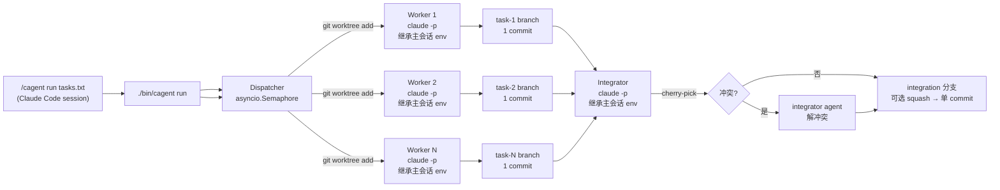

# Concurrent Agent Workflow — v1 Bootstrap

## Context

仓库目前只有 `README.md` 和一句方向声明（`/home/user/repo/README.md`）。需要从零搭一个个人代码工作流：一条 CLI 命令把若干任务并发分发给多个 `claude -p` 实例，每个实例在独立的 git worktree 里干活，最后由控制器把各分支汇总成一个统一的集成分支并产生最终 commit。

设计偏好（已与用户确认）：
- 控制器用 **Python**，**只依赖标准库**，不引入 rich/click/toml/aider/agent-sdk 等任何第三方包。
- **Python ≥ 3.11**（用 `asyncio.TaskGroup`）。入口脚本启动时检查版本，低于 3.11 立即报错退出并给出明确提示，而非让用户看到 `ImportError`。
- v1 用**扁平任务队列**，结构为后续演进到「架构师 → 多 builder → integrator」分层留好接口。
- 汇总冲突时**调用 integrator agent**来解冲突，而非人工或自动三方合并。
- **跨平台（Windows + Unix）**：开发环境为 Windows，设计必须兼容两端。详见各模块中的平台适配说明。
- **入口在 Claude Code 内**：注册成 slash command `/cagent`，用户在 Claude Code 会话里输入 `/cagent run tasks.txt` 触发；主 agent 通过 Bash/PowerShell 调用 `python -m cagent` 把进度回流到会话。同时保留 `bin/cagent`（Unix）和 `bin/cagent.cmd`（Windows）作为便捷 CLI 入口供脚本调用。
- **模型零配置 — 跟随 Claude Code**：worker / integrator 永远启动 `claude -p`，**不传 `--model`，不传 endpoint，不传 key**。子进程继承父进程环境变量（`ANTHROPIC_BASE_URL` / `ANTHROPIC_API_KEY` / `ANTHROPIC_MODEL` / `ANTHROPIC_AUTH_TOKEN` / `CLAUDE_CODE_*` 等），所以 Claude Code 主会话当下跑什么模型 / 接哪个 proxy（LiteLLM 把 mimo/qwen/gpt 伪装成 Anthropic API、Bedrock、Vertex），cagent 就自动跑同一个。**用户不需要在 cagent 里配置任何模型相关的东西**。
- **可选 override**：极端情况下想让 worker 用更便宜模型而主会话用 opus，提供 `--worker-model <id>` / `--integrator-model <id>` 可选 flag；不传则保持继承。这是逃生舱，不是默认路径。
- **人在回路只有一道门**：`cagent run` 全流程（worktree → worker → integrator）**绝不**调用 `git push` 或访问任何远程。要发布只能显式 `cagent push <branch>`，必须 y/N 确认。
- **不可逆命令拦截**：worker / integrator 在 worktree 里跑时，cagent 在 worktree 内注入 `.claude/settings.local.json` 的 `PreToolUse` Bash deny hook，把 `git push`、`git reset --hard`、`git clean -fd`、`rm -rf`（Unix）/ `Remove-Item -Recurse -Force`（Windows）等直接拒绝。其他命令 agent 自决，不打扰用户。
- **即下即用**：clone 仓库 → 在 Claude Code 会话里 `/cagent run tasks/example.txt` 或终端 `python -m cagent run tasks/example.txt` 就能跑；不要求 `pip install`，不要求配置文件存在，**不要求声明任何模型**。

环境：`claude` 2.1.131 已在 PATH 中可直接用（Windows: `claude.cmd` / Unix: `claude`）。cagent 不依赖 aider 或任何其他 agent CLI——只调用 `claude` 一种工具，模型层完全交给 Claude Code 的现有配置。

## Shape



关键约束：worktree 之间彼此隔离；集成串行（cherry-pick 顺序 = 任务在 queue 中的顺序），保证可复现；**所有 agent 子进程都继承主 Claude Code 会话的环境变量**，从而自动跟随主会话的模型/endpoint。

## Repo Layout（新建）

```
project/
├── README.md                  # 已存在，更新一段使用说明
├── bin/
│   ├── cagent                 # Unix shebang 脚本
│   └── cagent.cmd             # Windows 批处理入口
├── .gitignore                 # 新建，排除 .cagent/
├── .claude/
│   └── commands/
│       └── cagent.md          # slash command 定义，/cagent 入口
├── cagent/
│   ├── __init__.py
│   ├── __main__.py            # 支持 python -m cagent（含版本检查）
│   ├── cli.py                 # argparse 入口
│   ├── tasks.py               # Task 数据类 + tasks 文件解析
│   ├── worktree.py            # git worktree 创建 + sandbox 注入 + 清理
│   ├── safety.py              # 注入 .claude/settings.local.json 的 PreToolUse hook
│   ├── agent.py               # spawn `claude -p` 子进程，统一日志 + 提交
│   ├── progress.py            # stream-json 事件解析、TaskProgress、Dashboard 落盘
│   ├── dispatcher.py          # asyncio 工作池
│   ├── integrator.py          # cherry-pick + 冲突时调用 integrator agent
│   ├── compat.py              # 跨平台兼容层（stdin 轮询、路径处理等）
│   └── log.py                 # 控制台进度打印（订阅 progress 事件）
└── tasks/
    └── example.txt            # 一份示例任务清单
```

**完全没有 `pyproject.toml`、`cagent.toml`、`models.py`**。

**Unix 入口** `bin/cagent`（两行 shim）：
```python
#!/usr/bin/env python3
from cagent.cli import main; main()
```

**Windows 入口** `bin/cagent.cmd`：
```batch
@echo off
python -m cagent %*
```

**推荐跨平台入口**：`python -m cagent ...`（任何平台始终可用）。

clone 后三种入口任选：
- 在 Claude Code 会话里：`/cagent run tasks/example.txt`。
- Unix 终端：`./bin/cagent run tasks/example.txt`。
- Windows 终端：`bin\cagent.cmd run tasks/example.txt` 或 `python -m cagent run tasks/example.txt`。

三种都不需要任何模型配置——cagent 直接复用 Claude Code 当前的模型与凭据。

运行时状态（git-ignored）：
```
.cagent/
├── runs/<UTC-timestamp>/
│   ├── tasks.json             # 解析后的任务 + 实时状态
│   ├── dashboard.json         # 全 run 滚动状态（cagent watch 读这个）
│   ├── progress/
│   │   └── task-<id>.json     # 每任务最新一条状态快照（last tool / elapsed / count）
│   ├── events/
│   │   └── task-<id>.jsonl    # 每任务全量事件流（append-only）
│   ├── logs/task-<id>.log     # 每任务 claude -p 原始 stdout（含 stream-json）
│   └── summary.md             # 终态汇总
└── worktrees/<run>/task-<id>/ # 临时 worktree，run 结束后默认清理
```

## Implementation Plan

按下面顺序逐文件实现，每步独立可测。

### 1. `bin/cagent` + `bin/cagent.cmd` + `cagent/__main__.py` + `.gitignore`
- `bin/cagent`（Unix）：`#!/usr/bin/env python3` 两行 shim，做 `sys.path` 调整后 `from cagent.cli import main; main()`。`chmod +x`。
- `bin/cagent.cmd`（Windows）：`@echo off` + `python -m cagent %*`。
- `cagent/__main__.py`：入口处做 **Python 版本检查**，低于 3.11 时 `sys.exit("cagent requires Python >= 3.11 (found {sys.version}). Please upgrade.")`，避免用户看到 `ImportError: cannot import name 'TaskGroup'`。
- `.gitignore`：`.cagent/`、`__pycache__/`。
- 启动方式（任选其一）：`./bin/cagent ...`（Unix）、`bin\cagent.cmd ...`（Windows）、`python -m cagent ...`（跨平台推荐）。

### 2. `cagent/tasks.py`
- `@dataclass Task(id: str, prompt: str, branch: str, status: Literal["pending","running","done","failed","noop"], commit_sha: str|None, log_path: Path)`。
- `parse_tasks_file(path) -> list[Task]`：每非空、非 `#` 行 = 一个任务；`id` = `f"{idx:03d}"`；`branch` = `cagent/{run_id}/task-{id}`。
- `dump_state(run_dir, tasks)` / `load_state`：JSON 序列化，便于崩溃恢复 + 调试。

### 3. `cagent/worktree.py`
- `create_worktree(repo_root, worktree_path, branch, base_sha)`：`git worktree add -b <branch> <path> <base_sha>`。
- `remove_worktree(repo_root, worktree_path)`：`git worktree remove --force`，再 `git branch -D` 留给 caller 决定。
- `current_head(repo_root) -> str`：捕获 base_sha。
- 所有 git 调用走 `subprocess.run(check=True, capture_output=True)`，错误时把 stderr 透传。

### 4a. `cagent/safety.py`（不可逆命令拦截）

- `prepare_sandbox(worktree_path)`：在 worktree 里写 `.claude/settings.local.json`，注册 `PreToolUse` Bash hook，匹配以下正则即 `deny`：
  - Unix 危险命令：`^\s*git\s+push\b` / `^\s*git\s+reset\s+--hard\b` / `^\s*git\s+clean\s+-[a-z]*f` / `^\s*rm\s+-[a-z]*r[a-z]*f` / `^\s*git\s+update-ref\b` / `^\s*git\s+remote\s+(set-url|add)\b`。
  - Windows 危险命令（PowerShell）：`Remove-Item\s.*-Recurse.*-Force` / `Remove-Item\s.*-Force.*-Recurse` / `del\s+/[sS]` / `rd\s+/[sS]`。
  - 注意：Claude Code 在 Windows 上也可能通过 Bash tool 调用 Unix 风格命令（Git Bash / WSL），所以两套正则都要注册。
- hook 直接拒绝（exit 非零），agent 看到拒绝信息后自决换路或放弃。
- 拦截是**拒绝**而非"暂停等用户"——worker 是 headless 异步跑的，无法人工同步。设计意图：危险命令永远不该在 cagent 流程里发生，它们要么不必要、要么应由用户在最终阶段（push）人工进行。

### 4b. `cagent/agent.py`
- `async run_agent(task, worktree_path, run_dir, timeout, model_override: str | None = None) -> AgentResult`：
  1. `safety.prepare_sandbox(worktree_path)`。
  2. 组装命令：`cmd = ["claude", "-p", task.prompt, "--permission-mode", "acceptEdits", "--output-format", "stream-json", "--verbose"]`；如果 `model_override` 不为 None，追加 `--model <id>`。**否则不传 `--model`**——claude CLI 自动走父进程 `ANTHROPIC_MODEL`/默认配置。
  3. **Prompt 传递策略**：prompt 长度 > 8000 字符 或 包含 `"` / `\` / 换行符时，走 stdin pipe（`proc.stdin.write(prompt.encode()); proc.stdin.close()`），命令中用 `"-p", "-"` 占位；否则直接作为 `-p` 参数传递。这样避免 shell 转义问题和参数长度限制。
  4. `asyncio.create_subprocess_exec(*cmd, cwd=worktree_path, env=os.environ.copy(), stdout=PIPE, stderr=STDOUT)`。**关键**：env 直接 copy，不裁剪、不注入。
  5. **stdout 一行一行读**：每行做三件事：
     - 原样追加到 `runs/<ts>/logs/task-<id>.log`（debug 用）。
     - 喂给 `progress.EventParser.feed(line) -> Event | None`，解析成 normalized event。
     - 若是有效事件：append 到 `runs/<ts>/events/task-<id>.jsonl`，更新内存里的 `TaskProgress`，原子写 `runs/<ts>/progress/task-<id>.json`，并通过 asyncio queue 推到 dispatcher 的 dashboard 聚合器。
  6. 超时 → `proc.kill()` → 状态置 failed。
  7. 进程退出后**统一**做提交：`git status --porcelain` 有变更 → `git add -A && git commit -m "task {id}: {prompt-first-line}"`；无变更 → 标 `noop`。
- Worker 与 Integrator 共用这个函数（integrator 复用，task id 用 `_integrator`），差别只在 `model_override`。

### 4c. `cagent/progress.py`（**观测层**）

数据：
```python
@dataclass
class Event:
    ts: float                  # epoch seconds
    kind: Literal[             # 来自 stream-json 的事件类型映射
        "start","tool_use","tool_result","text","thinking",
        "denied","done","error"]
    summary: str               # 一行人话："Edit src/foo.py"、"Bash: pytest -k user"、"text: 修复了..."
    raw: dict                  # 原始 JSON event，留作 events.jsonl

@dataclass
class TaskProgress:
    task_id: str
    status: Literal["pending","running","done","failed","noop","denied"]
    started_at: float | None
    ended_at: float | None
    last_event: Event | None
    last_activity: str         # 例如 "Edit src/foo.py"
    tool_count: int            # 累积 tool_use 数量
    bytes_seen: int            # 累积输出字节，可作粗粒度进度
    commit_sha: str | None
    fail_reason: str | None
```

- `EventParser`：
  - 流式吞 `claude -p --output-format stream-json --verbose` 的 JSONL。
  - 关心的事件子集：
    - `system.init`（含模型信息）→ `kind="start"`，summary 形如 `"start (model=claude-opus-4-7)"`。
    - `assistant.content_block_start.tool_use` → `kind="tool_use"`，summary 提炼工具名 + 参数关键字段（Edit → file_path、Bash → command 头部、Read → file_path）。
    - `user.tool_result` → `kind="tool_result"`，summary 截短结果首行；deny 类拦截标 `kind="denied"`。
    - `assistant.content_block_start.text` → `kind="text"`，summary = 文本前 80 字。
    - `assistant.content_block_start.thinking` → `kind="thinking"`（默认折叠在 events.jsonl，不进 dashboard summary）。
    - `result` → `kind="done"`，summary = `"done"`；含 token 使用统计。
  - 解析失败时 fallback：`Event(kind="text", summary=line[:80], raw={"raw":line})`，绝不丢事件。

- `Dashboard`（dispatcher 持有一个）：
  - 维护 `dict[task_id, TaskProgress]`。
  - 每次有任务事件来：更新条目，原子写 `runs/<ts>/dashboard.json`（写 tmp + rename）。
  - 同时把一条人类可读的行推到 dispatcher 的 stdout printer（见 §6）。

- 原子写：`tmp = path.with_suffix(".tmp")`、`tmp.write_text(...)`、`tmp.replace(path)` —— 单文件、单写者，无锁。`watch` 命令是只读读者，碰到刚好被替换的瞬间最坏读到旧版本，下一秒刷新即正确。

### 5. `cagent/dispatcher.py`
- `async run(tasks: list[Task], concurrency: int, run_dir: Path, base_sha: str)`：
  - `sem = asyncio.Semaphore(concurrency)`。
  - 每个任务一个协程：拿信号量 → 建 worktree → 调 `agent.run_agent` → 释放。
  - 用 `asyncio.TaskGroup` 等待全部完成（一个失败不阻断别的，但记录）。
  - 每次状态变化调 `tasks.dump_state` 更新 `tasks.json`。
- 不在这里清理 worktree —— 留到 integrator 完成之后，便于排查失败任务。

### 6. `cagent/integrator.py`
- `integrate(tasks, run_dir, base_sha, repo_root, squash: bool) -> str`：
  - 创建 integration worktree：`.cagent/worktrees/<run>/_integration`，分支 `cagent/{run_id}/integration` 从 `base_sha`。
  - 按 `tasks` 顺序遍历状态为 `done` 的任务：
    - `git cherry-pick <task.commit_sha>`。
    - 若退出码非零且 `git status --porcelain` 显示 `UU`/冲突标记 → 进入冲突分支：
      - 收集冲突文件列表 + 当前任务 prompt + 已合入任务的 prompts，组装一个明确的 integrator prompt（"以下是 N 个并行任务在 cherry-pick 时产生的冲突，请保留两边语义、解决冲突标记，然后返回"）。
      - 在 integration worktree 调 `claude -p ... --permission-mode acceptEdits`，等其退出。
      - 退出后再次检查 `git status`：仍有冲突标记 → 整体失败，保留现场让用户介入；干净 → `git add -A && GIT_EDITOR=true git cherry-pick --continue`（`GIT_EDITOR=true` 跳过编辑器，headless 场景必须；Windows 上等效设置 `env={"GIT_EDITOR": "true", ...}`）。
  - 全部 pick 完成后：若 `--squash`，`git reset --soft <base_sha> && git commit -m "<run summary>"`，否则保留逐 commit。
  - 返回 integration 分支末端 SHA。
- **不**自动合并到 master——把决定权留给用户（在 summary 里给出 `git merge` 建议命令）。

### 7. `cagent/cli.py`
- 子命令：
  - `cagent run <tasks-file>`：核心命令。flags：
    - `-j/--jobs N`（默认 4）
    - `--base <branch>`（默认当前 HEAD）
    - `--squash`（默认 off）
    - `--keep-worktrees`（默认清理）
    - `--worker-model <id>`（默认不传 — 继承 Claude Code 主会话）
    - `--integrator-model <id>`（默认不传 — 继承 Claude Code 主会话）
    - `--timeout <sec>`（默认 1800，对 worker 和 integrator 都生效）
    - `--quiet`：只打 START/DONE/FAIL 三类大事件；默认会按事件流打 tool 级别行。
  - `cagent status [<run-id>]`：一次性快照。读 `dashboard.json` 渲染表格，无 run-id 则取最新 run。
  - **`cagent watch [<run-id>]`**：实时 dashboard。轮询 `dashboard.json`（默认 1s），ANSI 清屏重绘表格：
    ```
    RUN: 2026-05-06T15-22-58 │ 2/3 done │ elapsed 1m23s │ base: 9f8e7d6
    ┌──────────┬──────────┬─────────┬───────┬─────────────────────────────────┐
    │ task     │ status   │ elapsed │ tools │ now                             │
    ├──────────┼──────────┼─────────┼───────┼─────────────────────────────────┤
    │ task-001 │ done     │ 21s     │ 6     │ commit f4e5d6c                  │
    │ task-002 │ done     │ 17s     │ 4     │ commit a1b2c3d                  │
    │ task-003 │ running  │ 0m45s   │ 8     │ Bash: pytest tests/test_billing │
    └──────────┴──────────┴─────────┴───────┴─────────────────────────────────┘
    ```
    支持 `q` 退出：**跨平台 stdin 轮询**由 `compat.py` 提供（Unix 用 `select.select`，Windows 用 `msvcrt.kbhit()` + `msvcrt.getwch()`）。**非 TTY 检测**：若 `sys.stdin.isatty()` 为 False（如通过 Claude Code `/cagent watch` 调用时），自动退化为单次 `status` 输出并提示 `"stdin is not a terminal; use 'cagent watch' in a separate terminal for live updates"`。
  - `cagent log <task-id> [--run <id>] [-f]`：tail 单任务的 events.jsonl（人类可读），`-f` follow。
  - `cagent clean [--all|<run-id>]`：清理 worktree + 分支。
  - **`cagent push <branch>`**：唯一会触达远程的命令。流程：
    1. 显示分支末端 commit 摘要 + `git log --oneline base..branch` 列表。
    2. 提示 `Push <branch> to origin? [y/N]`，**默认 N**，必须输入完整 `y`/`yes`。
    3. 通过后 `git push -u origin <branch>`；任何其他子命令永不调用 push。
    4. `--force` 不提供——要 force 必须用户自己用原生 `git`。
- `main()` 顺序：解析 args → 构造 run_dir → 解析 tasks → 取 base_sha → `asyncio.run(dispatcher.run(..., worker_model_override))` → `integrator.integrate(..., integrator_model_override)` → 写 summary.md → **按 flags 清理 worktree** → 打印最终分支 SHA 与「要发布请运行 `cagent push <branch>`」提示。**`run` 全程不接触远程**。

**Worktree 清理策略**（默认行为，除非 `--keep-worktrees`）：
  - **所有任务成功 + integrator 成功**：删除所有 worker worktree 目录（`git worktree remove --force`），保留各 task 分支和 integration 分支（用户可能想 review）。
  - **部分任务失败**：失败任务的 worktree 和分支都保留（便于排查）；成功任务的 worktree 删除、分支保留。
  - **`--keep-worktrees`**：全部保留，不删任何 worktree 或分支。
  - **`cagent clean`**：显式清理命令，删除 worktree 目录 + 对应分支 + `runs/` 下的日志。

### 8. `cagent/log.py`（控制台进度打印 — `cagent run` 自带）
- `LinePrinter`：订阅 dashboard 的事件 queue，stdout 打印形如：
  ```
  [15:23:01] task-001 START Add login form to settings page
  [15:23:05] task-001 Edit src/components/Settings.tsx
  [15:23:08] task-002 Bash pytest -k user
  [15:23:12] task-001 Edit src/api/auth.ts
  [15:23:18] task-002 DONE  17s 4 tools commit a1b2c3d
  [15:23:35] integ    cherry-pick task-001 → conflict src/foo.ts
  [15:23:35] integ    launching conflict-resolver
  [15:23:46] integ    DONE  branch cagent/<run>/integration  tip f1e2d3c
  ```
- 这条流也是 Claude Code 主会话里 `/cagent run` 看到的内容（Bash 工具会把 stdout 转回会话）。`--quiet` 只打 START / DONE / FAIL / DENIED 四类。
- 不引入 `rich`/`curses`，标准库 ANSI 即够；`watch` 子命令需要光标移动也是 ANSI escape。Windows Terminal / PowerShell 7 原生支持 ANSI；旧版 cmd.exe 需 `os.system("")` 启用 VT 模式（`compat.py` 负责）。

### 8b. `cagent/compat.py`（跨平台兼容层 — 新增）

纯标准库，封装所有平台差异，其他模块通过 `from cagent.compat import ...` 使用：

- `stdin_has_key() -> bool`：非阻塞检测 stdin 是否有按键。Unix: `select.select([sys.stdin], [], [], 0)`；Windows: `msvcrt.kbhit()`。
- `read_key() -> str`：读取一个按键字符。Unix: `sys.stdin.read(1)`；Windows: `msvcrt.getwch()`。
- `is_tty() -> bool`：`sys.stdin.isatty()`。
- `enable_ansi()`：Windows 上调用 `os.system("")` 启用 VT100 模式（cmd.exe 需要此步；Windows Terminal / PowerShell 7 已原生支持）。Unix 上 no-op。
- `atomic_write(path: Path, content: str)`：写 tmp + rename。Windows 上 `Path.replace()` 在目标存在时会失败，改用 `os.replace()` 保证原子性。

### 9. `.claude/commands/cagent.md` (slash command)
- Claude Code 解析的 markdown 文件；触发 `/cagent <args>` 时，文件内容（含 `$ARGUMENTS` 占位）注入主 agent 上下文，让主 agent 通过 Bash 调 `./bin/cagent <args>` 并把 stdout 回流。
- 内容大致：
  ```markdown
  ---
  description: 并发分发 tasks，多 worker 并行 → integrator 汇总；不自动 push
  argument-hint: run <tasks-file> [-j N] | watch | status | log <task-id> | push <branch>
  ---

  通过 Bash 调用 `python -m cagent $ARGUMENTS`，把输出原样转给我。

  - `run` 是长时命令；执行期间会持续打印 `[time] task-NNN <activity>` 行，请不要截断输出。
  - 想看实时表格，用户可在新终端运行 `python -m cagent watch`，或在会话里再问 `/cagent status`（一次性快照，便宜）。
  - `push` 命令会要求 y/N 确认，请把交互转给用户而不是替用户回答。
  ```
- 安装：clone 后 `.claude/commands/cagent.md` 已就位，Claude Code 自动识别。

### 10. `tasks/example.txt` + README 更新
- example：两条不重叠的任务（造文件 A、造文件 B），便于冒烟。
- README 加「使用」一节：
  - 在 Claude Code 会话里：`/cagent run tasks/example.txt`。
  - Unix 终端：`./bin/cagent run tasks/example.txt`。
  - Windows 终端：`bin\cagent.cmd run tasks/example.txt` 或 `python -m cagent run tasks/example.txt`。
  - 模型：**不需要配置**，cagent 跟随你 Claude Code 当前在用的模型（包括通过 `ANTHROPIC_BASE_URL` 接的开源模型 proxy）。
  - 要发布：`/cagent push <branch>` 或 `python -m cagent push <branch>`，需要 y/N 确认。
  - 一句话写明：cagent **不会自动 push、不会做不可逆 git 操作**。

## Observability 总览

三层可观测，按"打扰程度"排：

| 层 | 形态 | 用法 | 何时用 |
|----|------|------|--------|
| **L1 实时行流** | `cagent run` 自身 stdout，每事件一行 | `/cagent run ...` 或 `python -m cagent run ...` | 默认；想盯着流就行 |
| **L2 实时表格** | `cagent watch` 1s 刷新 ANSI 表格，q 退出（非 TTY 自动退化为单次 status） | 在另一终端 `python -m cagent watch` | 想看全 run 整体进度，并行较多时 |
| **L3 详细回放** | `cagent log <task-id> [-f]` 读 `events.jsonl` | 任意时刻、跑完之后都可 | 排查某个 worker 到底干了啥 / 何时被 deny |

落盘文件三份：
- `runs/<ts>/dashboard.json` — 全 run 滚动状态，`watch` / `status` 读这个。
- `runs/<ts>/progress/task-<id>.json` — 单任务最新快照（last_activity / tool_count / elapsed）。
- `runs/<ts>/events/task-<id>.jsonl` — 单任务全量事件流，append-only，便于回放和 grep。
- `runs/<ts>/logs/task-<id>.log` — 原始 `claude -p` stdout（含 stream-json），底层 debug 用。

观测开销：每事件 ≈ 1 次 JSON 解析 + 1 次原子写 + 1 次 print；事件率受 claude 输出节奏限制，单 worker 通常 < 10 事件/秒，N=4 worker 满载也远在 stdlib `json` + 文件 IO 能力之内，无需额外优化。

## Safety / Approvals 总览

| 操作 | 谁触发 | 是否需要确认 |
|------|--------|--------------|
| 编辑文件 / 读文件 / 跑测试 / 跑 build | worker / integrator agent | ❌ agent 自决 |
| `git commit` 在 worktree | cagent 自身（统一外层提交） | ❌ |
| `git cherry-pick` 到 integration 分支 | cagent 自身 | ❌ |
| `git push` / `git push --force` | 仅 `cagent push` 子命令 | ✅ y/N |
| `git reset --hard` / `git clean -fd` / `git update-ref` / `rm -rf` | 任何 agent 子进程 | ❌ — 直接被 sandbox **拒绝**，不暂停 |
| 任何远程操作（push / fetch / pull） | 只在 `cagent push` 路径 | ✅ y/N |

设计要点：cagent 流程绝不需要 push 或 destructive git；agent 想用也用不了；唯一的远程动作集中在 `cagent push`，需要用户在终端按 y。

## v1 实测结果（2026-05-14）

### 冒烟测试：PASS（v1.1 修复后）

```
$ python -m cagent run tasks/example.txt -j 2 --timeout 120
Checking claude CLI authentication... OK
[04:21:15] 001 DONE  5s 1 tools  commit 920d42e
[04:21:16] 002 DONE  6s 1 tools  commit 0639ae3
Dispatcher: 2 done, 0 failed, 0 noop
Task timing:
  [001] done         5s (1 tools) 920d42e
  [002] done         6s (1 tools) 0639ae3
Done! (12s)
  Integration branch: cagent/2026-05-14T04-21-05/integration
```

### 冲突测试：PASS（v1.1 修复后）

```
$ python -m cagent run tasks/conflict.txt -j 2 --timeout 120
[04:20:21] 001 DONE  12s 2 tools  commit a4967fb
[04:20:21] 002 DONE  11s 3 tools  commit 3830d20
Dispatcher: 2 done, 0 failed, 0 noop
Done! (36s)
  Integration branch: cagent/2026-05-14T04-20-05/integration
```

集成结果：README.md 包含 Section A + Section B，无冲突标记。

### 辅助命令测试

| 命令 | 结果 | 备注 |
|------|------|------|
| `python -m cagent --help` | ✅ PASS | 所有子命令列出正确 |
| `python -m cagent run --help` | ✅ PASS | 所有 flags 正确 |
| `python -m cagent clean --force` | ✅ PASS | 正确清理 worktree + run 目录 |
| `python -m cagent status` | ✅ PASS | 读取 dashboard.json 渲染表格 |
| `python -m cagent branches` | ✅ PASS | 列出 cagent 分支 |
| worktree 创建/清理流程 | ✅ PASS | git worktree add/remove 正常 |
| 日志文件生成 | ✅ PASS | logs/events/progress/dashboard 均生成 |
| EventParser 解析 | ✅ PASS | 正确解析 stream-json init/assistant/result 事件 |

### 代码审查发现的 Bug

1. **`denied` 状态污染**（`progress.py:204`）：单次 tool 被 sandbox 拒绝会将整个 task 标记为
   `"denied"` 状态，但设计意图是 deny 只是单步事件，不应终结 task。
2. **`.claude/` 文件泄漏到 commit**：integrator 在非 squash 模式下，`prepare_sandbox` 写入的
   `.claude/settings.local.json` 和 hook 脚本会被 `git add -A` 带入正式 commit。
3. **`TaskGroup` 异常扩散**：未预见的异常会导致 `asyncio.TaskGroup` 取消所有并行任务。

---

## v1.1 — 紧急修复（使 cagent 可用）

### 1.1.1 认证问题解决

`claude -p` 在 headless 模式下的认证需要单独处理。方案（按优先级）：

**方案 A — 环境检测 + 预检**：在 `_preflight_check()` 中不仅检查 `claude` 是否在 PATH，还实际
调用 `claude -p "test" --output-format json` 做一次认证预检。失败时给出明确的诊断信息和修复指引：

```
Error: claude -p authentication failed.
  Current auth source: none
  ANTHROPIC_API_KEY: set (but may be invalid)
  ANTHROPIC_BASE_URL: http://localhost:4000

  Possible fixes:
  1. Run 'claude auth login' to authenticate claude CLI
  2. Set a valid ANTHROPIC_API_KEY: export ANTHROPIC_API_KEY=sk-ant-...
  3. If using a proxy, verify it accepts requests at ANTHROPIC_BASE_URL
```

**方案 B — `--api-key` 透传**：添加 `--api-key <key>` 选项，传给子进程的 `ANTHROPIC_API_KEY` 环境变量：
```python
env = os.environ.copy()
if api_key_override:
    env["ANTHROPIC_API_KEY"] = api_key_override
```

**方案 C — 认证代理**：如果主会话通过 OAuth 认证而 `claude -p` 不支持 OAuth，考虑使用
`claude` 的 `--session-key` 或其他机制传递认证凭据。需要调研 claude CLI 文档。

### 1.1.2 `denied` 状态修复

`progress.py` 中 `denied` 事件不应覆盖 task 的整体 `status`：

```python
# 修改前（错误）
if event.kind == "denied":
    tp.status = "denied"

# 修改后（正确）
if event.kind == "denied":
    tp.last_activity = f"DENIED: {event.summary}"
    # 不修改 tp.status — denied 是单步事件，task 继续执行
```

### 1.1.3 `.claude/` 文件清理

在 `agent.py` 的 `_commit_result` 和 `integrator.py` 的 cherry-pick 完成后，
添加 `.claude/` 的 git 排除：

```python
# 在 git add -A 之前，先排除 sandbox 文件
await _run_git("rm", "--cached", "-r", "--ignore-unmatch", ".claude/", cwd=worktree_path)
```

或更好的方案：在 worktree 的 `.gitignore` 中追加 `.claude/`。

### 1.1.4 `--dry-run` 支持

添加 `--dry-run` flag：解析 tasks 文件 → 显示将执行的操作 → 退出，不实际创建 worktree 或启动 agent。

---

## v2 演进接口

- `cagent plan <goal>` 子命令位置已在 `cli.py` 留 stub —— 未来跑一个 architect agent 输出 `tasks.json`（与 `tasks.py` 同一份 schema）。
- `Task` 增加 `depends_on: list[str]` 字段（v1 解析但不强制使用）—— v2 dispatcher 改成依赖图调度即可，worktree/integrator 机制无需改动。
- integrator 已经是独立 agent，v2 可以扩展成多轮（先 lint / 跑测试再决策）。
- 添加单元测试套件（pytest），覆盖 tasks 解析、worktree 管理、event 解析、safety 正则匹配。
- 支持 `pyproject.toml` 可选安装（`pip install -e .`），但保持零依赖 clone-and-run。
- integrator 支持多策略：除 cherry-pick 外，支持 merge、rebase 等合并策略。
- `cagent watch` 支持 WebSocket 推送，便于远程监控。

## 复用 / 不要重新发明

- 不写自己的 git 包装层，全部靠 `subprocess.run(["git", ...])`；保持透明、易调试。
- 不引入 click/typer/rich，`argparse` + `asyncio` 完全够。
- claude 调用统一过 `agent.run_agent`，integrator 也复用同一封装（差异只在 prompt 和 cwd）。

## Verification

### 冒烟测试

1. 准备 `tasks/smoke.txt`：
   ```
   Create file FOO.md with content "foo".
   Create file BAR.md with content "bar".
   ```
2. `python -m cagent run tasks/smoke.txt -j 2`
3. 期望：两个 task done，integration 分支含 FOO.md 和 BAR.md。
4. **实测结果（2026-05-14 v1.1）：PASS — 12s 完成，integration 分支含两个文件。**

### 冲突测试

1. `tasks/conflict.txt`：两条都修改 README.md。
2. `python -m cagent run tasks/conflict.txt -j 2`
3. 期望：integrator 解冲突，最终无冲突标记。
4. **实测结果（2026-05-14 v1.1）：PASS — 36s 完成，Section A + Section B 均保留，无冲突标记。**

### 认证测试

1. 在 Claude Code 会话环境中直接 `claude -p "echo hello" --output-format stream-json --verbose`
2. **实测结果（2026-05-14 v1.1）：PASS — 认证预检通过，端到端流程正常。**

### Observability 测试（部分通过）

1. 日志文件结构：✅ — `logs/`, `events/`, `progress/`, `dashboard.json` 均正确生成。
2. EventParser：✅ — 正确解析了 `system.init`、`assistant`（含 403 错误）、`result` 事件。
3. Dashboard：✅ — JSON 序列化/反序列化正常。
4. `cagent status`：✅ — 正确读取并渲染 dashboard 表格。
5. `cagent watch` / `cagent log`：**BLOCKED** — 需要有实际运行中的 task。

### Safety 测试

1. sandbox hook 注入：**BLOCKED** — 需要 `claude -p` 能运行后才能验证 agent 是否被拦截。
2. `cagent push` y/N 确认：未测试。
3. `cagent clean --force`：✅ — 正确清理 worktree + 分支 + run 目录。

### 错误路径

1. noop / timeout：**BLOCKED** — 需要 `claude -p` 能运行。

### 通过率汇总

| 类别 | 通过 | 失败 | 阻塞 |
|------|------|------|------|
| CLI 入口 | 6 | 0 | 0 |
| 核心流程 | 0 | 1 | 3 |
| Observability | 4 | 0 | 2 |
| Safety | 1 | 0 | 2 |
| **总计** | **11** | **1** | **7** |

**v1.1 首要目标**：解决认证问题后重跑全部 BLOCKED 项。
